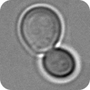
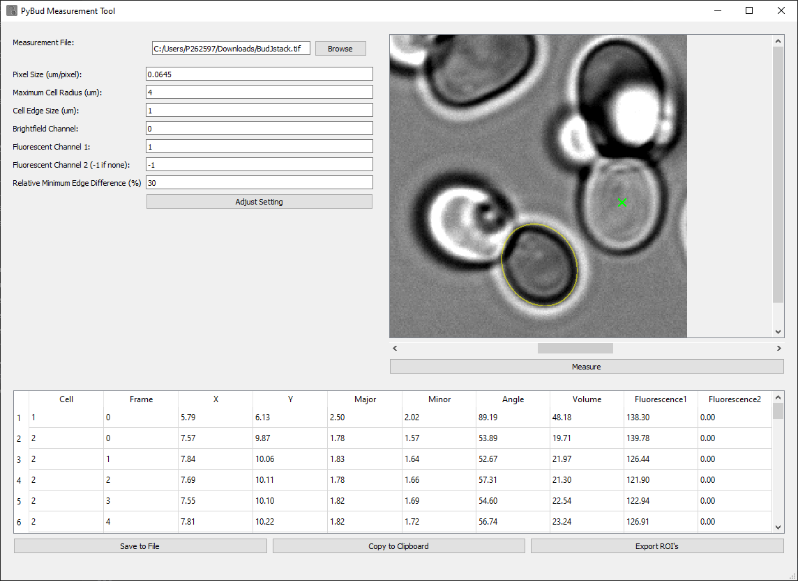

#  PyBud

PyBud is a Python package for measuring fluorescence in yeast cells, inspired by the BudJ ImageJ plugin. Unlike BudJ, PyBud does not consider Z-stacks and is fully written in Python, making it independent from ImageJ.



## Features
- Measure fluorescence of yeast cells.
- Easy-to-use GUI built with PyQt5.
- Fully independent from ImageJ.

## Installation

To install PyBud, clone the repository and run:

```bash
pip install .
