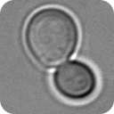
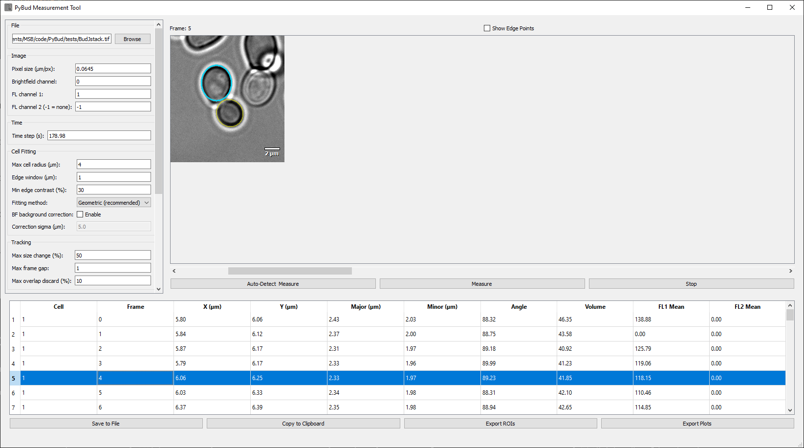
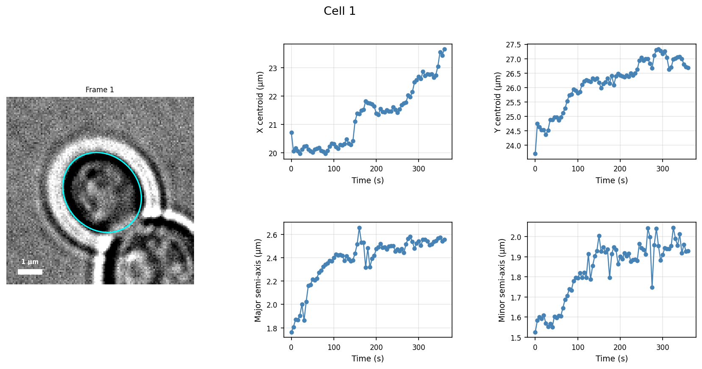
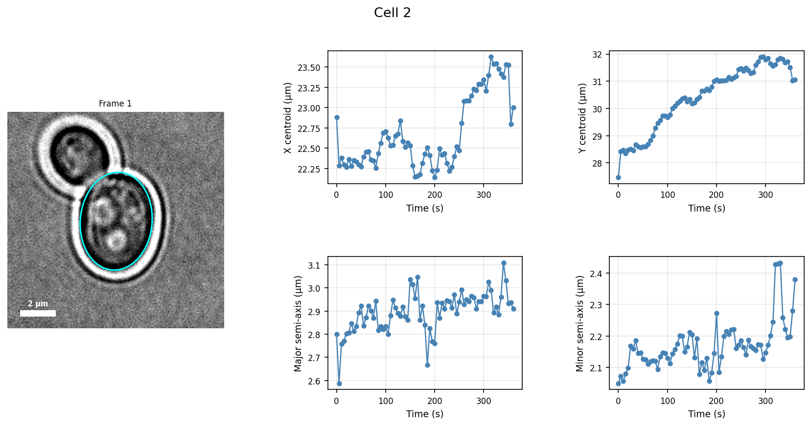

#  PyBud — Cell Tracking & Measurement Tool

PyBud is a Python tool for tracking and measuring yeast cells in brightfield time-lapse microscopy. It fits ellipses to cell boundaries frame-by-frame using radial edge detection, links detections into tracks across frames, and exports quantitative measurements alongside publication-quality plots. It is inspired by the BudJ ImageJ plugin but is fully written in Python and does not require ImageJ or Z-stacks.

---

## Table of Contents

1. [Installation](#installation)
2. [Quick Start](#quick-start)
3. [Interface Overview](#interface-overview)
4. [Parameter Reference](#parameter-reference)
5. [Workflows](#workflows)
6. [Results Table](#results-table)
7. [Exporting Data](#exporting-data)
8. [Command-Line Interface](#command-line-interface)
9. [Tips & Troubleshooting](#tips--troubleshooting)
10. [API Reference](#api-reference)

---

## Installation

### Requirements

Python 3.8 or later. Install dependencies with pip:

```
pip install PyQt5 numpy scipy scikit-image tifffile roifile matplotlib openpyxl pandas
```

### Getting started

Clone the repository and launch the GUI:

```bash
git clone https://github.com/MembraneEnzymology/PyBud.git
cd PyBud
python pybud_gui.py
```

### Project layout

```
PyBud/
├── pybud/                  # importable Python package
│   ├── tracker.py          # PyBud tracking engine
│   ├── autodetect.py       # AutoDetect — Hough-based cell detection
│   ├── plots.py            # Plots — figure export
│   ├── cell.py             # Cell — per-frame measurement
│   ├── ellipse.py          # Ellipse — boundary fitting
│   └── fluorescence.py     # Fluorescence — channel statistics
├── pybud_gui.py            # PyQt5 graphical interface
├── autotrack.py            # command-line pipeline
├── tests/                  # example scripts and small test data
└── images/                 # screenshots and example output figures
```

---

## Quick Start

1. Click **Browse** and open a multi-channel, multi-frame `.tif` file. Pixel size and time step are auto-populated from the file metadata when available.
2. Check that the **Image** parameters (pixel size, channel indices) are correct, then click **Adjust Settings**.
3. **Left-click** on a cell in the image to place a seed point (green cross). Seeds can be placed on any frame; PyBud tracks forward from that frame automatically.
4. Click **Measure**. Fitted ellipses appear in yellow; the results table populates with per-frame measurements.
5. Click **Export Plots** to save a time-series figure for each tracked cell.

---

## Interface Overview



The window is divided into three areas:

| Area | Description |
|---|---|
| **Left panel** | All parameters, grouped by function. Scrollable when the panel is narrow. |
| **Image panel** | Brightfield (or fluorescence) image with fitted ellipses, scale bar, and frame navigation. |
| **Results table** | Per-frame measurements for all tracked cells. Click any row to jump to that frame. |

### Image panel controls

| Action | Effect |
|---|---|
| Left-click on cell | Place a seed point (green cross) |
| Left-click on existing cross | Remove that seed |
| Right-click | Zoom in ×1.25 |
| Right-click + Shift | Zoom out ×0.75 |
| Scrollbar | Navigate through frames |
| Channel dropdown | Switch between brightfield and fluorescence channels |

A **scale bar** is shown in the bottom-right corner of the image and updates automatically when zooming. An **orange dashed line** connects a mother cell to its bud whenever both are visible in the same frame.

### Clicking a row in the table

Selecting any row in the results table immediately jumps the image to the corresponding frame and highlights that cell's ellipse in **cyan**. All other fitted cells remain yellow.

---

## Parameter Reference

### File

| Field | Description |
|---|---|
| File | Path to the `.tif` image stack. Use **Browse** to open. Pixel size and time step are read from the file metadata automatically. |

### Image

| Field | Default | Description |
|---|---|---|
| Pixel size (µm/px) | 0.0645 | Physical size of one pixel in micrometres. Auto-read from TIF metadata (OME-XML, ImageJ tags, or TIFF XResolution). |
| Brightfield channel | 0 | Zero-based channel index used for edge detection. |
| FL channel 1 | 1 | First fluorescence channel. Mean intensity inside the fitted ellipse is measured. Set to −1 to disable. |
| FL channel 2 | −1 | Second fluorescence channel. Set to −1 to disable. |

### Time

| Field | Default | Description |
|---|---|---|
| Time step (s) | 1.0 | Time between frames in seconds. Used as the X-axis in exported plots. Auto-read from TIF metadata when available. |

### Cell Fitting

| Field | Default | Description |
|---|---|---|
| Max cell radius (µm) | 4 | Maximum expected cell radius. Radial intensity profiles are sampled out to this distance from the seed point. |
| Edge window (µm) | 1 | Width of the sliding window used to detect the dark→bright transition at the cell wall. |
| Min edge contrast (%) | 30 | Minimum contrast relative to the image background for an edge to be accepted. Increase if false edges appear inside the cell. |
| Fitting method | Geometric | **Geometric** — non-linear least-squares fit (more accurate, recommended). **Algebraic** — direct linear fit (faster, less robust for imperfect edges). |
| BF background correction | off | Subtracts a Gaussian background from the brightfield channel before edge detection. Useful for uneven illumination. |
| Correction sigma (µm) | 5.0 | Spatial scale of the Gaussian background estimate. Should be larger than the cell diameter. |

### Tracking

| Field | Default | Description |
|---|---|---|
| Max size change (%) | 50 | Maximum permitted change in major or minor axis between consecutive frames. Detections exceeding this are treated as missed frames. |
| Max frame gap | 1 | Consecutive missed frames tolerated before a track terminates. Missed frames are filled by linear interpolation (shown as open markers in exported plots). |
| Max overlap discard (%) | 10 | If two fitted ellipses in the same frame overlap by more than this fraction of the smaller ellipse's area, the one with the higher track ID is discarded. |

### Auto-Detection (Hough)

Used only by **Auto-Detect & Measure**. Has no effect on plain **Measure**.

| Field | Default | Description |
|---|---|---|
| Min cell radius (µm) | 1.5 | Minimum radius searched by the circular Hough transform. |
| Max cell radius (µm) | 4.0 | Maximum radius searched by the circular Hough transform. |
| Max cells per frame | 10 | Upper limit on candidate circles per frame. Set this to the expected number of cells to reduce false positives. |
| Detection threshold (0–1) | 0.5 | Minimum Hough accumulator score. Increase toward 1.0 to accept only strong, well-defined circles. |
| Match distance (µm) | 8.0 | A candidate is linked to an existing track if its centroid is within this distance of the track's last known position. |

### Mother-Daughter (Bud) Detection

After every fitting run PyBud automatically checks whether any track originated as a bud from an existing cell. Two criteria must both be satisfied at the frame where the daughter first appears:

1. **Proximity** — the daughter's centroid is within `(r_mother + r_daughter) × bud_distance_factor` of the mother's centroid.
2. **Size** — the daughter is smaller than `r_mother × bud_size_ratio`.

The closest qualifying candidate is recorded as the mother. Results appear as an **orange dashed line** connecting centroids in the image. The **Mother Cell** column in the results table (disabled by default; enable via **Output Column Settings**) shows the mother's track ID, or `—` if none was found.

| Field | Default | Description |
|---|---|---|
| Bud distance factor | 1.2 | Proximity multiplier: `(r_m + r_d) × factor`. Increase if buds appear further from the mother edge. |
| Bud size ratio | 0.8 | Daughter must be smaller than `r_mother × ratio`. Decrease to require a larger size difference. |

---

## Workflows

### Manual measurement

1. Open a TIF file with **Browse**.
2. Set parameters and click **Adjust Settings**.
3. Navigate to any frame and **left-click** on each cell to place a seed (green cross).
4. Click **Measure**. Each seed is tracked forward through the stack.
5. Review results in the table and image.

Seeds can be added or removed at any time. Clicking **Measure** always recomputes from scratch using the current seeds and settings.

### Auto-Detect & Measure

1. Open a TIF file and adjust parameters as above.
2. Optionally tune the **Auto-Detection (Hough)** parameters.
3. Click **Auto-Detect & Measure**. PyBud will:
   - Run the Hough transform on every frame to find candidate circles.
   - Link candidates into tracks across frames using the **Match distance** threshold.
   - Place a seed only when a cell appears for the first time in a new track.
   - Fit and track all detected seeds using the same pipeline as **Measure**.
4. Seeds and fitted ellipses appear in the image; the results table populates automatically.

> **Tip:** If auto-detection picks up chip walls or agarose, lower **Max cells per frame** to the expected number of real cells, or raise **Detection threshold** to 0.7–0.8.

### Stopping a run

Click **Stop** at any time to interrupt fitting. Results computed up to that point are kept.

---

## Results Table

Each row corresponds to one cell on one frame. Columns can be toggled via **Output Column Settings**.

| Column | Unit | Description |
|---|---|---|
| Cell | — | Track ID (assigned in order of first detection) |
| Mother Cell | — | Track ID of the mother cell, or `—` if no mother detected. Disabled by default. |
| Frame | — | Zero-based frame index |
| Time | s | Frame index × time step |
| X | µm | X coordinate of the ellipse centroid |
| Y | µm | Y coordinate of the ellipse centroid |
| Major | µm | Major semi-axis of the fitted ellipse |
| Minor | µm | Minor semi-axis of the fitted ellipse |
| Angle | ° | Rotation angle of the major axis |
| Volume | µm³ | Approximate spherical volume: (4/3)π · ((a+b)/2)³ |
| Edge width | µm | Mean width of the detected cell boundary |
| FL1 Mean | a.u. | Mean fluorescence intensity inside the ellipse (channel 1) |
| FL2 Mean | a.u. | Mean fluorescence intensity inside the ellipse (channel 2) |

**Clicking any row** jumps the image to that frame and highlights the cell in cyan.

---

## Exporting Data

### Save to File

Saves the full table as **CSV** or **Excel (.xlsx)**. Select the format in the save dialog.

### Copy to Clipboard

Copies the table as tab-separated text, ready to paste into Excel or any spreadsheet.

### Export ROIs

Saves all fitted ellipses as an ImageJ-compatible `.zip` ROI file. Open it in Fiji via the ROI Manager to overlay ellipses on the original images.

### Export Plots

Generates one PNG per tracked cell, saved to a folder of your choice. Each figure contains:

- **Left** — cropped brightfield snapshot at the cell's first detected frame, with the fitted ellipse in cyan and a physical scale bar.
- **Right** — 2×2 time-series: X centroid, Y centroid, major semi-axis, and minor semi-axis vs. time (in seconds).

Interpolated frames are shown as **open markers**.

#### Example output





### Export Settings / Import Settings

**Export Settings** saves all current parameter values to a JSON file. **Import Settings** restores them in a future session — useful for keeping consistent settings across experiments.

---

## Command-Line Interface

`autotrack.py` is a headless pipeline that detects cells in frame 0 via Hough transform and tracks them forward — no GUI required. It is useful for batch processing or running on a compute server.

```bash
python autotrack.py <image.tif> [options]
```

### Examples

```bash
# Detect 3 cells, let the script read pixel size from TIF metadata
python autotrack.py tests/BudJstack.tif --n-cells 3

# Provide pixel size explicitly and save to a specific CSV
python autotrack.py movie.tif --pixel-size 0.064 --n-cells 2 --output results.csv
```

### Options

| Option | Default | Description |
|---|---|---|
| `--pixel-size FLOAT` | from metadata | µm per pixel |
| `--n-cells INT` | 2 | Cells to detect in frame 0 |
| `--cell-radius FLOAT` | 4.0 | Max search radius (µm) |
| `--edge-size FLOAT` | 1.0 | Edge-detection window (µm) |
| `--edge-rel-min INT` | 30 | Minimum edge contrast (%) |
| `--fitting-method STR` | `geometric` | `algebraic` or `geometric` |
| `--min-cell-radius FLOAT` | 1.5 | Min cell radius for Hough search (µm) |
| `--max-cell-radius FLOAT` | 4.0 | Max cell radius for Hough search (µm) |
| `--bf-channel INT` | auto | Override brightfield channel index |
| `--max-size-change FLOAT` | 0.5 | Max fractional radius change per frame (0 = disabled) |
| `--max-gap INT` | 1 | Max consecutive missed frames to bridge |
| `--output PATH` | `<image>_tracks.csv` | Output CSV path |

The script prints a per-track summary to the console and saves a CSV with one row per cell per frame.

---

## Tips & Troubleshooting

**Cell not found on some frames**
- The cell may drift out of the search radius — increase **Max cell radius**.
- Uneven illumination can obscure the cell edge — enable **BF Background Correction** with a sigma of ~5 µm.

**Duplicate tracks for the same cell**
- The **Max overlap discard** filter (default 10%) removes duplicates. Increase the threshold if duplicates remain.

**Auto-detect finds chip structures instead of cells**
- Lower **Max cells per frame** to the number of real cells expected.
- Raise **Detection threshold** to 0.7–0.8 to accept only strong candidates.

**Tracks terminate too early**
- Increase **Max frame gap** to bridge more missed frames.
- Loosen **Max size change (%)** if the cell grows or shrinks rapidly.

**Pixel size or time step are wrong after loading**
- Values are auto-read from TIF metadata (OME-XML, ImageJ tags, TIFF resolution). Override them manually in the settings panel and click **Adjust Settings**.

---

## API Reference

PyBud can be used as a Python library without the GUI, making it easy to integrate into batch scripts and analysis pipelines.

### Package overview

All public classes are importable directly from the `pybud` package:

```python
from pybud import PyBud, AutoDetect, Plots
from pybud import Cell, Ellipse, Fluorescence   # lower-level objects
from pybud import export_cell_plots              # convenience shortcut
```

| Module | Class | Purpose |
|---|---|---|
| `pybud.tracker` | `PyBud` | Core tracking engine |
| `pybud.autodetect` | `AutoDetect` | Hough-based cell detection |
| `pybud.plots` | `Plots` | Figure export |
| `pybud.cell` | `Cell` | Per-frame ellipse fitting and measurement |
| `pybud.ellipse` | `Ellipse` | Algebraic and geometric ellipse fitting |
| `pybud.fluorescence` | `Fluorescence` | Fluorescence channel statistics |

---

### `PyBud` — tracking engine

#### Key attributes

| Attribute | Type | Default | Description |
|---|---|---|---|
| `img` | `ndarray (T, C, H, W)` | `None` | Image stack. Set via `load()` or assign directly. |
| `pixel_size` | `float` | `0.0645` | µm per pixel |
| `time_step` | `float` | `1.0` | Seconds per frame |
| `time_unit` | `str` | `"s"` | Time unit label used in exported plots |
| `bf_channel` | `int` | `0` | Brightfield channel index |
| `fl_channels` | `list[int]` | `[1]` | Fluorescence channel indices |
| `cell_radius` | `float` | `4` | Max radial search distance from seed (µm) |
| `edge_size` | `float` | `1` | Edge-detection sliding-window width (µm) |
| `edge_rel_min` | `float` | `30` | Minimum relative edge contrast (%) |
| `fitting_method` | `str` | `"algebraic"` | `"geometric"` or `"algebraic"` |
| `bg_correction_sigma` | `float` | `0.0` | Gaussian sigma for BF background subtraction (µm; 0 = off) |
| `max_gap` | `int` | `1` | Max consecutive missed frames before track termination |
| `max_size_change` | `float` | `0.5` | Max fractional radius change per frame (0 = disabled) |
| `overlap_threshold` | `float` | `0.1` | Overlap fraction above which duplicate tracks are removed |
| `bud_distance_factor` | `float` | `1.2` | Proximity multiplier for mother-daughter detection |
| `bud_size_ratio` | `float` | `0.8` | Size ratio threshold for mother-daughter detection |
| `min_detect_radius_um` | `float` | `1.5` | Minimum cell radius for auto-detection (µm) |
| `max_detect_radius_um` | `float` | `4.0` | Maximum cell radius for auto-detection (µm) |
| `n_cells_max` | `int` | `10` | Maximum Hough candidates per frame |
| `hough_threshold` | `float` | `0.5` | Minimum Hough accumulator score (0–1) |
| `match_distance_um` | `float` | `8.0` | Max inter-frame displacement to keep as same track (µm) |
| `cells` | `list[Cell]` | `[]` | Results after `fit_cells()` |
| `mother_ids` | `dict` | `{}` | `{child_track_id: mother_track_id}` (−1 = no mother) |
| `selections` | `dict` | `{}` | `{frame: [(x, y), ...]}` seed points |

#### Methods

**`load(path) → self`**

Load a TIFF stack and auto-populate `pixel_size` and `time_step` from embedded metadata (OME-XML, ImageJ tags, or TIFF XResolution). Normalises the array to `(T, C, H, W)`. Returns `self` for method chaining.

**`add_selection(frame, x, y)`**

Add a seed point at pixel `(x, y)` on `frame`. PyBud tracks this cell forward through all subsequent frames.

**`remove_selection(frame, x, y)`**

Remove the nearest seed to `(x, y)` on `frame` (within `selection_radius` pixels). Returns `True` if a seed was removed.

**`fit_cells(callback=None)`**

Track all current seeds and populate `self.cells`. Runs fitting in parallel threads. After fitting, performs gap filling (linear interpolation), overlap filtering, and mother-daughter detection. The optional `callback(frame)` is called after each frame for progress reporting.

**`clear()`**

Remove all seeds, fitted cells, and cached results.

**`stop()`**

Signal a running `fit_cells()` to stop after the current frame (thread-safe).

---

### `Cell` — per-frame measurement

Each element of `pybud.cells` is a `Cell` object (or a lightweight interpolated substitute for gap frames):

| Attribute | Unit | Description |
|---|---|---|
| `id` | — | Track ID |
| `frame` | — | Zero-based frame index |
| `cell_found` | `bool` | Whether the fit succeeded |
| `interpolated` | `bool` | `True` for linearly gap-filled frames |
| `x_centroid` | µm | Centroid X |
| `y_centroid` | µm | Centroid Y |
| `major` | µm | Major semi-axis |
| `minor` | µm | Minor semi-axis |
| `angle` | ° | Rotation angle of the major axis |
| `edge_width` | µm | Mean detected boundary width |
| `volume` | µm³ | Approximate spherical volume: (4/3)π·((a+b)/2)³ |
| `mother_id` | — | Track ID of mother cell, or −1 |
| `fluorescence` | `list[Fluorescence]` | One entry per FL channel |

Each `Fluorescence` object exposes: `mean`, `sd`, `median`, `min`, `max`, `background`, `mean_bg_subtracted`, `integrated_density`, `area`, `brightest_10`, `brightest_25`, `brightest_50`.

---

### `AutoDetect` — Hough-based detection

`AutoDetect` runs entirely in NumPy / scikit-image with no Qt dependency. It can be used in scripts or called from `autotrack.py`.

**`AutoDetect().detect(pb, frame_callback=None) → int`**

Two-phase detection on all frames of `pb.img`. Phase 1: find candidate circles per frame using the Hough transform. Phase 2: link candidates across frames into tracks; add a seed to `pb.selections` only when a new track begins. Returns the total number of seeds placed. All detection parameters are read from the `PyBud` instance.

**`AutoDetect.detect_frame(bf_frame, min_r_px, max_r_px, n_max=10, threshold=0.5) → list`**

Static method. Runs the Hough transform on a single brightfield frame (after percentile normalisation and large-scale background subtraction). Returns a list of `(x, y)` pixel positions.

---

### `Plots` — figure export

`Plots` uses matplotlib only and has no Qt dependency.

**`Plots.export_cell_plots(cells, time_step, time_unit, out_dir, img=None, bf_channel=0, pixel_size=1.0) → int`**

Generates one PNG per cell track. When `img` is provided, a cropped brightfield snapshot with ellipse overlay and scale bar is placed to the left of a 2×2 time-series grid. Returns the number of files saved.

`export_cell_plots` is also available as a top-level shortcut: `from pybud import export_cell_plots`.

---

### Example: batch script

```python
import pandas as pd
from pybud import PyBud

pb = PyBud(fitting_method="geometric")
pb.load("my_movie.tif")          # pixel_size and time_step auto-read from metadata

pb.bf_channel   = 0
pb.fl_channels  = [1]
pb.cell_radius  = 4              # µm
pb.edge_rel_min = 30

pb.add_selection(0, 150, 200)   # frame 0, pixel (x=150, y=200)
pb.add_selection(0, 320, 185)

pb.fit_cells()

rows = []
for cell in pb.cells:
    if not cell.cell_found:
        continue
    fl = cell.fluorescence[0] if cell.fluorescence else None
    rows.append({
        "cell_id":      cell.id,
        "mother_id":    cell.mother_id,
        "frame":        cell.frame,
        "time_s":       cell.frame * pb.time_step,
        "x_um":         cell.x_centroid,
        "y_um":         cell.y_centroid,
        "major_um":     cell.major,
        "minor_um":     cell.minor,
        "volume_um3":   cell.volume,
        "fl1_mean":     fl.mean if fl else None,
        "interpolated": getattr(cell, "interpolated", False),
    })

df = pd.DataFrame(rows)
df.to_csv("results.csv", index=False)
print(df)
```

### Example: auto-detection

```python
from pybud import PyBud, AutoDetect

pb = PyBud().load("my_movie.tif")
pb.bf_channel  = 0
pb.fl_channels = [1]

# Tune detection parameters if needed
pb.min_detect_radius_um = 1.5
pb.max_detect_radius_um = 4.0
pb.n_cells_max          = 5
pb.hough_threshold      = 0.6

n_seeds = AutoDetect().detect(pb)
print(f"Placed {n_seeds} seed(s)")

pb.fit_cells()

for cell_id, mother_id in pb.mother_ids.items():
    if mother_id >= 0:
        print(f"Cell {cell_id} is a bud of cell {mother_id}")
```

### Example: single-frame Hough detection

```python
import tifffile
from pybud import AutoDetect

img        = tifffile.imread("my_movie.tif")   # (T, C, H, W)
pixel_size = 0.0645

hits = AutoDetect.detect_frame(
    bf_frame  = img[0, 0],
    min_r_px  = 1.5 / pixel_size,
    max_r_px  = 4.0 / pixel_size,
    n_max     = 10,
    threshold = 0.5,
)
print("Detected cells at (x, y) px:", hits)
```

### Example: export plots

```python
from pybud import PyBud, Plots

pb = PyBud().load("my_movie.tif")
pb.add_selection(0, 150, 200)
pb.fit_cells()

found = [c for c in pb.cells if c.cell_found]
n = Plots.export_cell_plots(
    found, pb.time_step, pb.time_unit, "output_plots/",
    img=pb.img, bf_channel=pb.bf_channel, pixel_size=pb.pixel_size,
)
print(f"Saved {n} plot(s).")
```
